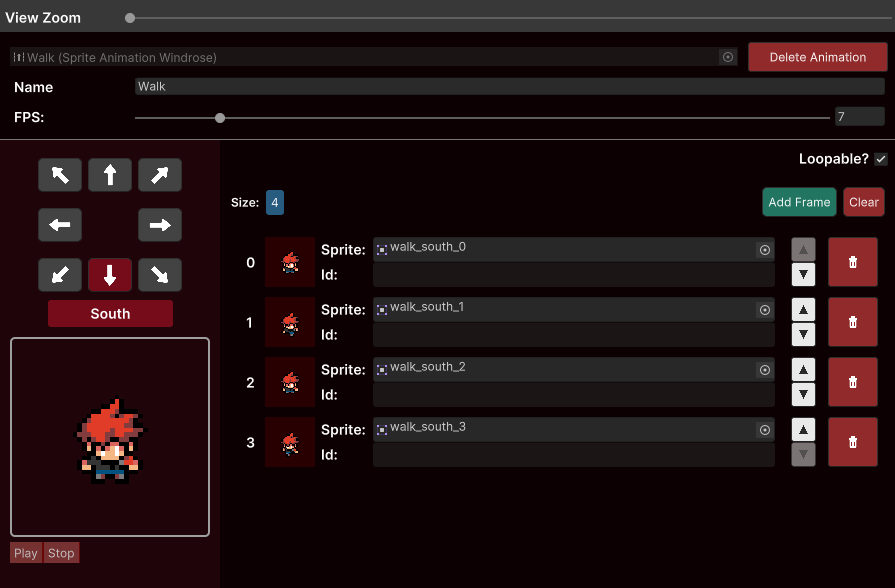

# Windrose animation



The windrose animation is a collection of [Frame Cycles](../animations-manager/index.md#frame-cycle) each representing one of the 8-directional cardinal windrose system directions. Perfect for top-down games.

The main feature of this type of animation is that you will tell the animator to play just one animation and then tell it for wich direction it should set the sprites while animating. Super easy!


Refer to [WinroseAnimator](../sprite-animator/windrose-animator.md) in order to understand how you can interact with it through code.

## Creating on demand

You can create Windrose animations on demand by acessing the static method `SpriteAnimationWindrose.OnDemand`. Just provide the fps, a dictionary containing the [cycles](../animations-manager/index.md#frame-cycle) as lists of Sprites, and a boolean telling if it should be loopable or not.

Example:

```csharp
public SpriteAnimator _animator;
public int _fps;

public List<Sprite> _northCycle;
public List<Sprite> _eastCycle;
public List<Sprite> _southCycle;
public List<Sprite> _westCycle;

private SpriteAnimationWindrose _animation;
private WindroseAnimator _performer;

private void Awake()
{
    Dictionary<WindroseDirection, List<Sprite>> cycles = new()
    {
        { WindroseDirection.North, _northCycle },
        { WindroseDirection.East, _eastCycle },
        { WindroseDirection.South, _southCycle },
        { WindroseDirection.West, _westCycle }
    };

    _animation = SpriteAnimationWindrose.OnDemand(_fps, cycles, true);
}

private void Start()
{
    _performer = _animator.Play<WindroseAnimator>(_animation);
    StartCoroutine(CycleThrough());
}

private IEnumerator CycleThrough()
{
    int counter = 0;

    while (true)
    {
        switch (counter)
        {
            case 0:
                _performer.SetDirection(WindroseDirection.East);
                break;
            case 1:
                _performer.SetDirection(WindroseDirection.South);
                break;
            case 2:
                _performer.SetDirection(WindroseDirection.West);
                break;
            case 3:
                _performer.SetDirection(WindroseDirection.North);
                break;
        }

        yield return new WaitForSeconds(2);

        counter++;
        if (counter == 4)
        {
            counter = 0;
        }
    }
}
```

## Creating from a template

You can use any other Windrose Animation as template for creating another Windrose Animation. Just use the `UseAsTemplate` method providing
a dictionary containing the [cycles](../animations-manager/index.md#frame-cycle) as lists of Sprites.

Example:

```csharp
public SpriteAnimator _animator;
public SpriteAnimationWindrose _template;

public List<Sprite> _northCycle;
public List<Sprite> _eastCycle;
public List<Sprite> _southCycle;
public List<Sprite> _westCycle;

private SpriteAnimationWindrose _animation;
private WindroseAnimator _performer;

private void Awake()
{
    Dictionary<WindroseDirection, List<Sprite>> cycles = new()
    {
        { WindroseDirection.North, _northCycle },
        { WindroseDirection.East, _eastCycle },
        { WindroseDirection.South, _southCycle },
        { WindroseDirection.West, _westCycle }
    };

    _animation = _template.UseAsTemplate(cycles);
}

private void Start()
{
    _performer = _animator.Play<WindroseAnimator>(_animation);
    StartCoroutine(CycleThrough());
}

private IEnumerator CycleThrough()
{
    int counter = 0;

    while (true)
    {
        switch (counter)
        {
            case 0:
                _performer.SetDirection(WindroseDirection.East);
                break;
            case 1:
                _performer.SetDirection(WindroseDirection.South);
                break;
            case 2:
                _performer.SetDirection(WindroseDirection.West);
                break;
            case 3:
                _performer.SetDirection(WindroseDirection.North);
                break;
        }

        yield return new WaitForSeconds(2);

        counter++;
        if (counter == 4)
        {
            counter = 0;
        }
    }
}
```
